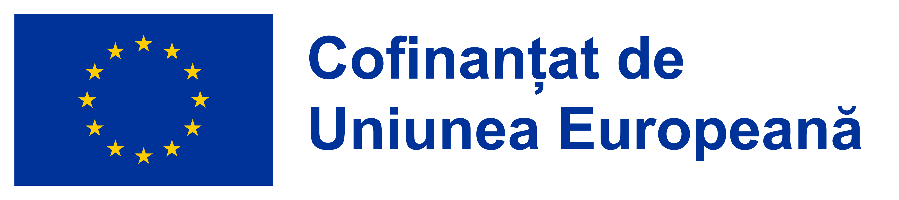

# CLARA Research

## Overview

### RO:

Depozit public de diseminare a cercetării pentru **proiectul CLARA - acronim de la CyberSecurity Learning And Response Agent**.

Proiectul CLARA este un proiect de cercetare-dezvoltare în securitate cibernetică, asistat de inteligență artificială, axat pe arhitecturi agentice modulare, utilizarea controlată a uneltelor, execuție auditabilă, fundamentarea răspunsurilor în cunoaștere de securitate cibernetică, date sintetice și evaluare repetabilă.

Acest depozit conține exclusiv rezumate publice și materiale de diseminare a cercetării. Materialele publicate explicit aici sunt diseminate ca artefacte publice de cercetare open source sub Apache License 2.0, cu excepția cazurilor în care un fișier precizează altfel. Această licență publică nu include materialele CLARA nepublice sau operele protejate prin drepturi de autor, proprietate a AI STM LEARNING S.R.L., care nu sunt incluse explicit în acest depozit.

Acest depozit nu publică secrete operaționale, seturi de date private, elemente interne de probă, credențiale, jurnale brute, artefacte de implementare proprietare sau detalii confidențiale de implementare.

### EN:

Public research-dissemination repository for **CLARA - CyberSecurity Learning And Response Agent**.

CLARA is an AI-assisted cybersecurity research and development project focused on modular agentic architectures, controlled tool use, auditable execution, cybersecurity knowledge grounding, synthetic data, and repeatable evaluation.

This repository contains public summaries and research-dissemination materials only. The materials expressly published here are disseminated as open-source public research artifacts under the Apache License 2.0, unless a file states otherwise. This public license does not include non-public CLARA materials or proprietary copyrighted works owned by AI STM LEARNING S.R.L. that are not expressly included in this repository.

This repository does not publish operational secrets, private datasets, internal evidence, credentials, raw logs, proprietary implementation artifacts, or confidential implementation details.

## European Funding Visibility

<p>
  
  
</p>

### RO:

Proiectul CLARA - acronim de la **CyberSecurity Learning And Response Agent** - este implementat de **AI STM LEARNING S.R.L.** și este cofinanțat de Uniunea Europeană prin **Programul Creștere Inteligentă, Digitalizare și Instrumente Financiare 2021-2027 (POCIDIF/PCIDIF)**, Prioritatea 1, Obiectivul specific RSO1.1, Acțiunea 1.1, apelul `PCIDIF/155/PCIDIF_P1/OP1/RSO1.1/PCIDIF_A1`, contractul de finanțare `390016/28.08.2025`, cod SMIS `334596`.

Pentru informații detaliate despre celelalte programe cofinanțate de Uniunea Europeană, vă invităm să vizitați [www.fonduri-ue.ro](https://www.fonduri-ue.ro).

### EN:

CLARA - **CyberSecurity Learning And Response Agent** is implemented by **AI STM LEARNING S.R.L.** and is co-financed by the European Union through the **Program Creștere Inteligentă, Digitalizare și Instrumente Financiare 2021-2027 (POCIDIF/PCIDIF)**, Priority 1, Specific Objective RSO1.1, Action 1.1, call `PCIDIF/155/PCIDIF_P1/OP1/RSO1.1/PCIDIF_A1`, financing contract `390016/28.08.2025`, SMIS code `334596`.

## Extended Readmes

### RO:

Prezentarea publică extinsă este împărțită în fișiere README dedicate fiecărei limbi.

- [README extins în română](ro/README.md)
- [README extins în limba engleză](en/README.md)

### EN:

The extended public presentation is split into language-specific README files.

- [English extended README](en/README.md)
- [Romanian extended README](ro/README.md)

## Public Architecture Documents

### RO:

| Temă | Română | Engleză |
| --- | --- | --- |
| Roluri AI | [ro/arhitectura/ROLURI_AI.md](ro/arhitectura/ROLURI_AI.md) | [en/architecture/AI_ROLES.md](en/architecture/AI_ROLES.md) |
| Execuție și integrare | [ro/arhitectura/EXECUTION_AND_INTEGRATION.md](ro/arhitectura/EXECUTION_AND_INTEGRATION.md) | [en/architecture/EXECUTION_AND_INTEGRATION.md](en/architecture/EXECUTION_AND_INTEGRATION.md) |

### EN:

| Topic | English | Romanian |
| --- | --- | --- |
| AI roles | [en/architecture/AI_ROLES.md](en/architecture/AI_ROLES.md) | [ro/arhitectura/ROLURI_AI.md](ro/arhitectura/ROLURI_AI.md) |
| Execution and integration | [en/architecture/EXECUTION_AND_INTEGRATION.md](en/architecture/EXECUTION_AND_INTEGRATION.md) | [ro/arhitectura/EXECUTION_AND_INTEGRATION.md](ro/arhitectura/EXECUTION_AND_INTEGRATION.md) |

## Public Research Reports

### RO:

| Raport | Română | Engleză |
| --- | --- | --- |
| Raportul 01 | [ro/rapoarte/RAPORT_01.md](ro/rapoarte/RAPORT_01.md) | [en/reports/REPORT_01.md](en/reports/REPORT_01.md) |
| Raportul 02 | [ro/rapoarte/RAPORT_02.md](ro/rapoarte/RAPORT_02.md) | [en/reports/REPORT_02.md](en/reports/REPORT_02.md) |

### EN:

| Report | English | Romanian |
| --- | --- | --- |
| Report 01 | [en/reports/REPORT_01.md](en/reports/REPORT_01.md) | [ro/rapoarte/RAPORT_01.md](ro/rapoarte/RAPORT_01.md) |
| Report 02 | [en/reports/REPORT_02.md](en/reports/REPORT_02.md) | [ro/rapoarte/RAPORT_02.md](ro/rapoarte/RAPORT_02.md) |

## Citation

### RO:

Dacă utilizați sau citați acest depozit public de diseminare a cercetării, vă rugăm să folosiți următoarea referință:

```bibtex
@misc{clara_research_2026,
  author       = {{AI STM LEARNING S.R.L.}},
  title        = {{CLARA Research: Public Research Dissemination Repository for CyberSecurity Learning And Response Agent}},
  year         = {2026},
  howpublished = {\url{https://github.com/clara-stm/research}},
  note         = {Public bilingual research dissemination repository for the CLARA project; POCIDIF/PCIDIF, SMIS 334596}
}
```

### EN:

If you use or reference this public research-dissemination repository, please cite it as:

```bibtex
@misc{clara_research_2026,
  author       = {{AI STM LEARNING S.R.L.}},
  title        = {{CLARA Research: Public Research Dissemination Repository for CyberSecurity Learning And Response Agent}},
  year         = {2026},
  howpublished = {\url{https://github.com/clara-stm/research}},
  note         = {Public bilingual research dissemination repository for the CLARA project; POCIDIF/PCIDIF, SMIS 334596}
}
```

## License

### RO:

Cu excepția cazurilor în care se precizează altfel, numai fișierele și materialele publicate explicit în acest depozit sunt puse la dispoziție sub Apache License 2.0.

Apache License 2.0 nu acordă drepturi asupra materialelor CLARA nepublice sau asupra operelor, software-ului, seturilor de date, modelelor, prompturilor, descrierilor de infrastructură, mărcilor, secretelor comerciale, know-how-ului sau altor elemente de proprietate intelectuală aparținând AI STM LEARNING S.R.L., care nu sunt incluse explicit în acest depozit.

### EN:

Unless stated otherwise, only the files and materials expressly published in this repository are made available under the Apache License 2.0.

The Apache License 2.0 does not grant rights to non-public CLARA materials or to proprietary copyrighted works, software, datasets, models, prompts, infrastructure descriptions, trademarks, trade secrets, know-how, or other intellectual property owned by AI STM LEARNING S.R.L. that are not expressly included in this repository.
