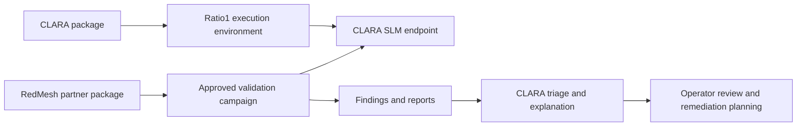

# Execution And Integration Architecture

This document summarizes the public architecture position for CLARA execution,
partner integration, threat-intelligence infrastructure, and graph-based
knowledge support. It is a public research-dissemination note and does not
publish internal endpoints, credentials, private datasets, operational runbooks,
or non-public implementation details.

## Executive Position

CLARA should not be presented only as a standalone research prototype. Its
technical and dissemination value increases when it can be packaged for
controlled execution environments, integration frameworks, application
marketplaces, and partner product bundles. The strategic goal is not broad
distribution before maturity, but a staged path from controlled pilots to
repeatable integration packages.

| Topic | Architectural position | Recommended timing |
| --- | --- | --- |
| Frameworks and app stores | Relevant for discoverability, repeatable packaging, and partner adoption once APIs, manifests, permissions, and public claims are stable. | After controlled pilots and documentation hardening. |
| Ratio1 execution | Strongly relevant as an optional execution fabric for controlled, non-hyperscaler, edge-aware demonstrations and distributed evaluation. | Early staging and pilot validation. |
| Ratio1 RedMesh | Highly relevant as a partner-product integration path for adversarial validation and report-analysis workflows. | Start as validation target and analysis consumer, then move toward deeper partner packaging. |
| Dedicated MISP instance | Useful if CLARA needs a controlled threat-intelligence hub, sharing workflows, feed governance, and structured indicator lifecycle. | Conditional; begin with connector/export design, deploy only after governance and ownership are clear. |
| Neo4j graph layer | Useful when CLARA needs explicit relationship traversal, GraphRAG, attack-path reasoning, and explainable links between entities. | Conditional; add when graph queries exceed what document retrieval and relational storage can support. |

## Integration Into Frameworks, App Stores, And Partner Packages

CLARA should be prepared for integration into external frameworks and application
catalogs because cybersecurity adoption often happens through existing operator
surfaces rather than through a new standalone console. A packaged CLARA module can
be easier to test, procure, and operate when it includes a stable manifest,
permission model, versioned API, sample scenarios, privacy notes, and measurable
validation outputs.

The main value of this path is not marketing visibility alone. It creates a
repeatable engineering contract:

- what CLARA receives as input;
- what CLARA is allowed to call or execute;
- what artifacts and logs it produces;
- how human operators review outputs;
- how partners can embed CLARA without receiving non-public internals.

Partner packages are especially relevant for MSSP, MDR, integrator, and
validation-product channels. A partner bundle can combine CLARA's analysis,
summarization, triage, and explanation role with a partner product that already
generates cybersecurity findings or operational events.

The guardrail is maturity. CLARA should enter broad app-store style distribution
only after access scopes, public claims, update policy, support boundaries,
license boundaries, and data-handling limits are stable enough to avoid
over-promising.

## Ratio1 As Execution Fabric

Ratio1 is relevant to CLARA as an optional execution fabric, not merely as an
alternative hosting location. The useful architectural role is controlled
execution of compact model endpoints and distributed jobs in a non-hyperscaler,
edge-aware environment.

The proposed mapping is:

| CLARA need | Ratio1-related capability | Architectural value |
| --- | --- | --- |
| Containerized model serving | Deeploy and container apps on Ratio1 Edge Nodes | Repeatable SLM endpoint packaging and deployment. |
| Distributed evaluation | ChainDist-style worker execution | Benchmarking, batch analysis, and robustness checks across heterogeneous nodes. |
| Artifact handling | R1FS or controlled artifact storage | Traceable handling of models, adapters, reports, and validation bundles. |
| Identity and access | dAuth and allow-listed execution | Separation between operator, orchestrator, node, and client identities. |
| State and coordination | CStore / ChainStore-style state | Better traceability for distributed jobs and validation campaigns. |

The recommended execution pattern is `serving + distributed evaluation`: CLARA
runs a containerized SLM endpoint, while distributed workers execute evaluation,
batch analysis, or validation workloads. This pattern supports the public
research narrative around controlled, auditable, restricted-compute-aware
cybersecurity AI without turning Ratio1 into the only possible CLARA runtime.

## Ratio1 RedMesh As Partner Product Integration

RedMesh is relevant because it can connect CLARA to a partner validation product
rather than only to infrastructure. In the recommended first stage, RedMesh tests
approved CLARA endpoints or flows and produces findings. CLARA then consumes the
resulting reports or finding bundles for summarization, grouping, prioritization,
and explanation.

This gives CLARA two clear roles:

| Role | Description | Why it matters |
| --- | --- | --- |
| CLARA as target | RedMesh runs approved adversarial validation against CLARA surfaces. | Produces scenario-bound validation evidence for hardening. |
| CLARA as analysis consumer | CLARA processes RedMesh findings and produces triage-oriented explanations. | Demonstrates cyber-specific language-model utility on realistic outputs. |

The later-stage integration path is a partner package such as `CLARA + RedMesh
Validation Pack`. That package can combine deployment, adversarial validation,
evidence collection, CLARA-assisted triage, and a reusable report structure.

The limit must remain explicit: RedMesh validation is evidence under defined
scenarios, not a general security guarantee.

## Dedicated MISP Instance

A dedicated MISP instance, for example `misp.clara.stm.ai`, is architecturally
useful if CLARA needs a controlled threat-intelligence hub. MISP can support
collection, storage, sharing, and structured handling of cyber indicators and
threat intelligence. It can also provide a practical bridge between CLARA outputs
and established cyber-intelligence workflows.

The need is conditional rather than absolute. CLARA can begin with MISP-compatible
data export and connector design before operating its own instance. A dedicated
instance becomes justified when at least one of the following conditions is true:

- CLARA needs persistent curation of threat indicators, events, galaxies,
  taxonomies, or sharing communities;
- CLARA needs controlled ingestion from public, partner, or internal
  threat-intelligence feeds;
- CLARA needs an analyst-reviewed place for converting model outputs into
  structured threat-intelligence records;
- CLARA needs a stable integration target for SIEM, SOC, MSSP, or partner
  workflows.

The decision has operational consequences. A CLARA-specific MISP instance needs a
named owner, update and backup policy, access model, data-classification rules,
feed governance, retention policy, and review process for what CLARA may write
automatically. The public architecture position is therefore:

`[RECOMMENDATION]` Design MISP integration now, but deploy `misp.clara.stm.ai`
only when operational ownership and data governance are confirmed.

## Neo4j And The Graph Knowledge Layer

Neo4j is relevant if CLARA needs a dedicated graph knowledge layer for GraphRAG,
attack-path reasoning, entity linking, relationship traversal, and explainable
connections between cybersecurity concepts. It can support questions that are
hard to answer with document retrieval alone, such as how an asset, technique,
indicator, vulnerability, control, and remediation action relate to each other.

Neo4j should not be treated as mandatory storage for every CLARA function. It is
best introduced behind a knowledge-layer abstraction, so CLARA can keep the
public architecture independent from one database implementation until the graph
schema, query patterns, and maintenance burden are justified.

The recommended staged path is:

1. Define the graph schema at concept level: assets, indicators, techniques,
   vulnerabilities, controls, evidence, reports, and remediation actions.
2. Validate GraphRAG use cases on a limited corpus.
3. Add Neo4j when graph traversal measurably improves retrieval quality,
   explanation, auditability, or analyst workflow.
4. Keep vector retrieval, document retrieval, and graph retrieval as cooperating
   mechanisms rather than competing replacements.

## Decision Matrix

| Component | Add now? | Decision |
| --- | --- | --- |
| Framework and app-store packaging | Prepare now, distribute later. | Define manifests, APIs, permission scopes, and public integration claims. |
| Ratio1 execution | Yes, as optional execution architecture. | Use for staging, pilots, distributed evaluation, and controlled demonstrations. |
| RedMesh integration | Yes, staged. | Begin with CLARA as target and analysis consumer; package later with partner workflow. |
| MISP instance | Not as an immediate dependency. | Build connector/export path now; deploy dedicated instance after governance is ready. |
| Neo4j | Not as a blanket requirement. | Add when GraphRAG and graph traversal use cases justify the operational cost. |

## References

- [Ratio1 RedMesh overview](https://ratio1.ai/blog/ratio1-redmesh-decentralized-distributed-cybersecurity)
- [Ratio1 RedMesh README](https://github.com/Ratio1/edge_node/blob/develop/extensions/business/cybersec/README.md)
- [Ratio1 SDK README](https://github.com/Ratio1/ratio1_sdk/blob/main/README.md)
- [MISP core software](https://github.com/MISP/MISP)
- [MISP documentation](https://www.misp-project.org/documentation/)
- [MISP core format](https://www.misp-standard.org/rfc/misp-standard-core.html)
- [Neo4j GraphRAG overview](https://neo4j.com/labs/genai-ecosystem/graphrag/)
- [Neo4j GraphRAG for Python](https://neo4j.com/docs/neo4j-graphrag-python/current/index.html)
