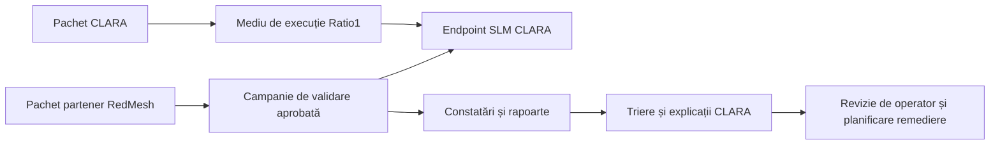

# Arhitectura de execuție și integrare

Acest document sintetizează poziția publică de arhitectură pentru execuția CLARA,
integrarea în produse partenere, infrastructura de informații despre amenințări
și stratul de cunoaștere bazat pe grafuri. Este o notă publică de diseminare a
cercetării și nu publică endpoint-uri interne, credențiale, seturi de date
private, proceduri operaționale sau detalii de implementare nepublice.

## Poziție executivă

CLARA nu trebuie prezentat doar ca prototip de cercetare izolat. Valoarea tehnică
și de diseminare crește atunci când sistemul poate fi ambalat pentru medii
controlate de execuție, cadre de integrare, magazine de aplicații și pachete de
produse partenere. Obiectivul strategic nu este distribuția largă înainte de
maturizare, ci o trecere etapizată de la piloturi controlate la pachete de
integrare repetabile.

| Subiect | Poziție arhitecturală | Moment recomandat |
| --- | --- | --- |
| Cadre de integrare și magazine de aplicații | Relevante pentru descoperire, ambalare repetabilă și adopție prin parteneri după stabilizarea API-urilor, manifestelor, permisiunilor și mesajelor publice. | După piloturi controlate și întărirea documentației. |
| Execuție pe Ratio1 | Foarte relevantă ca substrat opțional de execuție pentru demonstrații controlate, fără dependență de hyperscaler, cu orientare către edge și evaluare distribuită. | Staging timpuriu și validare în pilot. |
| Ratio1 RedMesh | Foarte relevant ca traseu de integrare în produse partenere pentru validare adversarială și analiză de rapoarte. | Inițial ca țintă de validare și consumator de analiză, apoi ca pachet partener mai profund. |
| Instanță MISP dedicată | Utilă dacă CLARA are nevoie de centru controlat pentru informații despre amenințări, fluxuri de partajare, guvernanță de fluxuri externe și ciclu de viață pentru indicatori. | Condiționat; se începe cu proiectare de conector și export, iar lansarea se face numai după clarificarea guvernanței și a proprietarului operațional. |
| Strat Neo4j | Util când CLARA are nevoie de traversare explicită de relații, GraphRAG, raționament pe căi de atac și legături explicabile între entități. | Condiționat; se adaugă când interogările pe graf depășesc ce poate susține recuperarea din documente și stocarea relațională. |

## Integrarea în cadre, magazine de aplicații și pachete partenere

CLARA trebuie pregătit pentru integrare în cadre externe și cataloage de
aplicații deoarece adopția în securitate cibernetică se produce adesea prin
suprafețe operaționale existente, nu printr-o consolă nouă. Un modul CLARA
ambalat este mai ușor de testat, achiziționat și operat dacă include manifest
stabil, model de permisiuni, API versionat, scenarii de exemplu, note de
confidențialitate și rezultate de validare măsurabile.

Valoarea principală nu este doar vizibilitatea. Această direcție creează un
contract tehnic repetabil:

- ce primește CLARA ca intrare;
- ce are voie CLARA să apeleze sau să execute;
- ce artefacte și jurnale produce;
- cum sunt revizuite răspunsurile de operatori umani;
- cum pot partenerii să integreze CLARA fără acces la elemente nepublice.

Pachetele partenere sunt relevante mai ales pentru MSSP, MDR, integratori și
produse de validare. Un pachet partener poate combina rolul CLARA de analiză,
sinteză, triere și explicare cu un produs partener care generează deja constatări
de securitate cibernetică sau evenimente operaționale.

Limita este maturitatea. CLARA trebuie introdus în distribuție largă de tip magazin
de aplicații numai după stabilizarea domeniilor de acces, mesajelor publice,
politicii de actualizare, limitelor de suport, limitelor de licență și regulilor de
prelucrare a datelor.

## Ratio1 ca substrat de execuție

Ratio1 este relevant pentru CLARA ca substrat opțional de execuție, nu doar ca loc
alternativ de găzduire. Rolul arhitectural util este execuția controlată a
endpoint-urilor compacte de model și a joburilor distribuite într-un mediu
non-hyperscaler, orientat către edge.

Maparea propusă este:

| Nevoie CLARA | Capabilitate asociată Ratio1 | Valoare arhitecturală |
| --- | --- | --- |
| Servire de model containerizat | Deeploy și aplicații containerizate pe Ratio1 Edge Nodes | Ambalare și lansare repetabilă pentru endpoint-uri SLM. |
| Evaluare distribuită | Execuție de tip ChainDist pe workeri | Benchmark, analiză batch și teste de robustețe pe noduri eterogene. |
| Gestionare de artefacte | R1FS sau stocare controlată de artefacte | Gestionare trasabilă pentru modele, adaptoare, rapoarte și pachete de validare. |
| Identitate și acces | dAuth și execuție prin liste de permisiuni | Separare între operator, orchestrator, nod și identitate client. |
| Stare și coordonare | Stare de tip CStore / ChainStore | Trasabilitate mai bună pentru joburi distribuite și campanii de validare. |

Patternul recomandat de execuție este `serving + evaluare distribuită`: CLARA
rulează un endpoint SLM containerizat, iar workerii distribuiți execută evaluări,
analize batch sau sarcini de validare. Acest model susține narațiunea publică de
cercetare privind inteligența artificială pentru securitate cibernetică, controlată,
auditabilă și adaptată la resurse restrictive, fără a transforma Ratio1 în singurul
mediu de rulare posibil pentru CLARA.

## Ratio1 RedMesh ca integrare în produs partener

RedMesh este relevant deoarece poate conecta CLARA la un produs partener de
validare, nu doar la infrastructură. În prima etapă recomandată, RedMesh testează
endpoint-uri sau fluxuri CLARA aprobate și produce constatări. CLARA consumă apoi
rapoartele sau pachetele de constatări pentru sinteză, grupare, prioritizare și
explicare.

Această abordare oferă CLARA două roluri clare:

| Rol | Descriere | De ce contează |
| --- | --- | --- |
| CLARA ca țintă | RedMesh execută validare adversarială aprobată asupra suprafețelor CLARA. | Produce dovezi de validare limitate la scenarii definite, utile pentru întărire. |
| CLARA ca analizor | CLARA procesează constatări RedMesh și produce explicații orientate către triere. | Demonstrează utilitatea modelelor de limbaj pe rezultate cibernetice realiste. |

Traseul ulterior este un pachet partener de tip `CLARA + RedMesh Validation Pack`.
Acesta poate combina lansare, validare adversarială, colectare de dovezi, triere
asistată de CLARA și structură reutilizabilă de raportare.

Limita trebuie să rămână explicită: validarea RedMesh oferă dovezi în scenarii
definite, nu o garanție generală de securitate.

## Instanță MISP dedicată

O instanță MISP dedicată, de exemplu `misp.clara.stm.ai`, este utilă arhitectural
dacă CLARA are nevoie de un centru controlat pentru informații despre amenințări.
MISP poate sprijini colectarea, stocarea, partajarea și gestionarea structurată a
indicatorilor și a informațiilor despre amenințări. De asemenea, poate crea o punte
practică între rezultatele CLARA și fluxurile consacrate de intelligence
cibernetic.

Necesitatea este condiționată, nu absolută. CLARA poate începe cu proiectare de export
și conector compatibil MISP înainte de a opera o instanță proprie. O instanță
dedicată devine justificată când este adevărată cel puțin una dintre condițiile de
mai jos:

- CLARA are nevoie de curare persistentă pentru indicatori, evenimente, galaxii,
  taxonomii sau comunități de partajare;
- CLARA are nevoie de ingestie controlată din fluxuri publice, partenere sau
  interne de informații despre amenințări;
- CLARA are nevoie de un spațiu revizuit de analiști pentru transformarea
  răspunsurilor de model în înregistrări structurate de intelligence cibernetic;
- CLARA are nevoie de o țintă stabilă de integrare pentru SIEM, SOC, MSSP sau
  fluxuri partenere.

Decizia are consecințe operaționale. O instanță MISP specifică CLARA are nevoie de
proprietar nominal, politică de actualizare și backup, model de acces, reguli de
clasificare a datelor, guvernanță de fluxuri externe, politică de retenție și proces de
revizuire pentru ceea ce CLARA poate scrie automat.

`[RECOMANDARE]` Integrarea MISP trebuie proiectată acum, dar lansarea
`misp.clara.stm.ai` trebuie făcută numai după confirmarea proprietarului operațional
și a guvernanței datelor.

## Neo4j și stratul de cunoaștere bazat pe grafuri

Neo4j este relevant dacă CLARA are nevoie de un strat dedicat de cunoaștere bazat
pe grafuri pentru GraphRAG, raționament pe căi de atac, legarea entităților,
traversarea relațiilor și conexiuni explicabile între concepte de securitate
cibernetică. Acest strat poate susține întrebări greu de rezolvat doar prin
recuperare de documente, de exemplu cum se leagă un activ, o tehnică, un indicator,
o vulnerabilitate, un control și o acțiune de remediere.

Neo4j nu trebuie tratat ca stocare obligatorie pentru fiecare funcție CLARA. Este
preferabil să fie introdus în spatele unei abstractizări de strat de cunoaștere,
astfel încât arhitectura publică să nu depindă de o singură implementare de bază de
date înainte ca schema de graf, interogările și costul de mentenanță să fie
justificate.

Traseul etapizat recomandat este:

1. Definirea conceptuală a schemei de graf: active, indicatori, tehnici,
   vulnerabilități, controale, dovezi, rapoarte și acțiuni de remediere.
2. Validarea cazurilor de utilizare GraphRAG pe un corpus limitat.
3. Adăugarea Neo4j când traversarea grafului îmbunătățește măsurabil calitatea
   recuperării, explicația, auditabilitatea sau fluxul de lucru al analistului.
4. Păstrarea recuperării vectoriale, recuperării din documente și recuperării din
   graf ca mecanisme cooperante, nu ca înlocuitori exclusivi.

## Matrice de decizie

| Componentă | Se adaugă acum? | Decizie |
| --- | --- | --- |
| Ambalare pentru cadre și magazine de aplicații | Pregătire acum, distribuție mai târziu. | Se definesc manifeste, API-uri, domenii de permisiuni și mesaje publice de integrare. |
| Execuție pe Ratio1 | Da, ca arhitectură opțională de execuție. | Se folosește pentru staging, piloturi, evaluare distribuită și demonstrații controlate. |
| Integrare RedMesh | Da, etapizat. | Se începe cu CLARA ca țintă și analizor; pachetul partener se maturizează ulterior. |
| Instanță MISP | Nu ca dependență imediată. | Se construiește traseul de conector și export; instanța dedicată se lansează după pregătirea guvernanței. |
| Neo4j | Nu ca cerință generală. | Se adaugă când GraphRAG și traversarea grafului justifică efortul operațional. |

## Referințe

- [Ratio1 RedMesh overview](https://ratio1.ai/blog/ratio1-redmesh-decentralized-distributed-cybersecurity)
- [Ratio1 RedMesh README](https://github.com/Ratio1/edge_node/blob/develop/extensions/business/cybersec/README.md)
- [Ratio1 SDK README](https://github.com/Ratio1/ratio1_sdk/blob/main/README.md)
- [MISP core software](https://github.com/MISP/MISP)
- [MISP documentation](https://www.misp-project.org/documentation/)
- [MISP core format](https://www.misp-standard.org/rfc/misp-standard-core.html)
- [Neo4j GraphRAG overview](https://neo4j.com/labs/genai-ecosystem/graphrag/)
- [Neo4j GraphRAG for Python](https://neo4j.com/docs/neo4j-graphrag-python/current/index.html)
